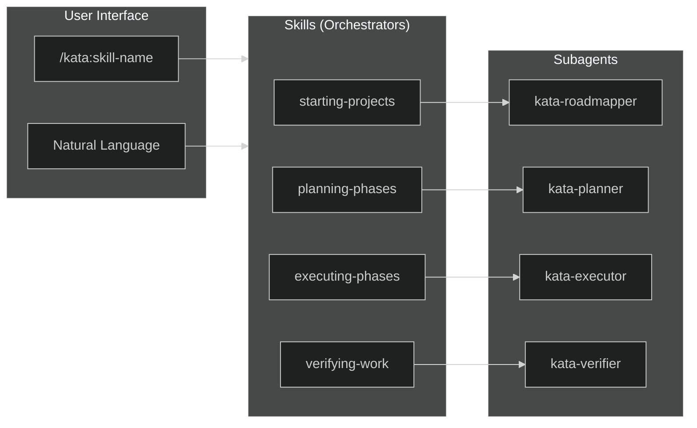
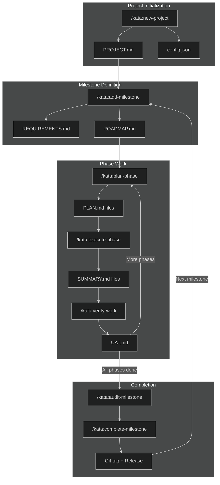
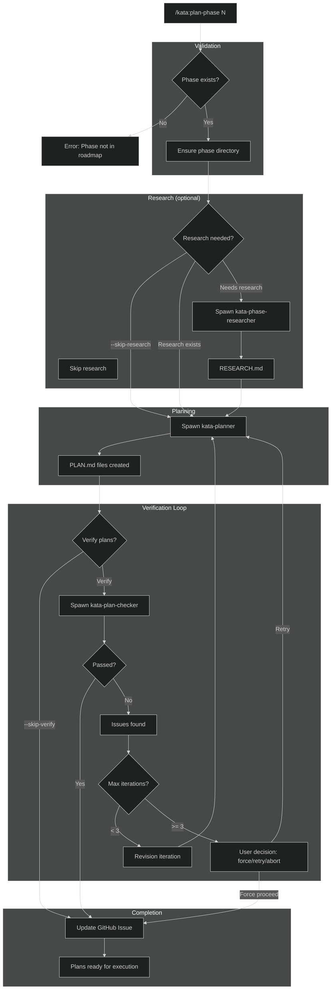
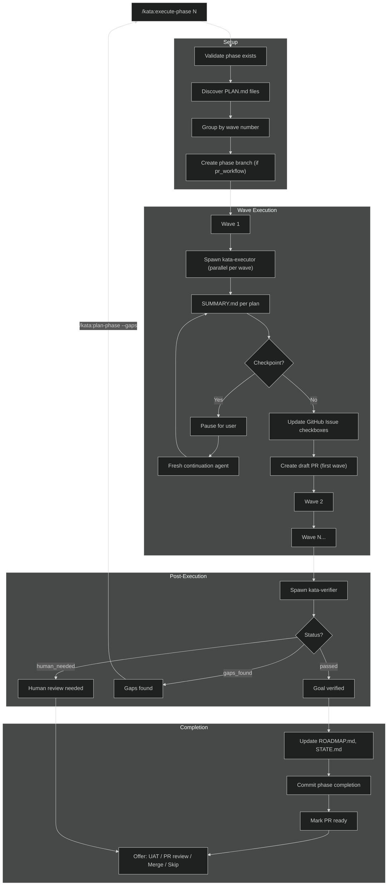
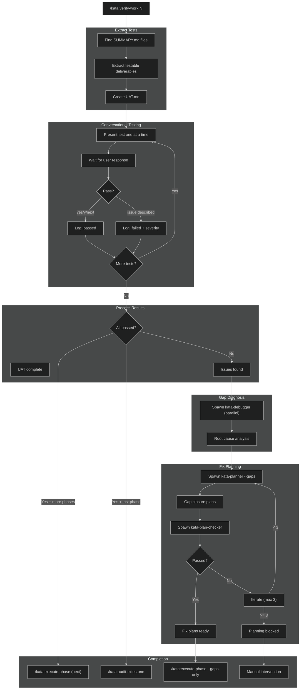
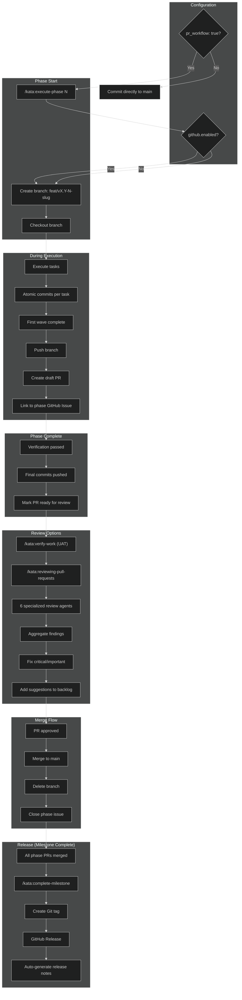

# Kata Workflow Diagrams

Mermaid flow diagrams documenting Kata's major workflow paths.

## 1. High-Level Orchestration

How users interact with skills, which orchestrate agents.

> **Note:** This diagram shows the core skill-to-agent pattern. Additional skills include `adding-milestones`, `reviewing-pull-requests`, and `completing-milestones`. Additional agents include `kata-project-researcher`, `kata-phase-researcher`, `kata-plan-checker`, `kata-debugger`, `kata-code-reviewer`, and others. See [GLOSSARY.md](GLOSSARY.md) for the complete list.

## 2. Project Lifecycle

State machine from project creation to milestone completion.

## 3. Planning Flow

The planning-phases skill workflow with research and verification loop.

## 4. Execution Flow

The executing-phases skill workflow with wave parallelization.

## 5. Verification Flow

The verifying-work skill workflow for UAT and gap closure.

## 6. PR Workflow

Branch-based pull request workflow with GitHub integration.

