# Kata Glossary

Authoritative terminology reference for Kata. This document defines key terms, shows relationships between concepts, and serves as a quick reference for both humans and future Claude instances.

## Quick Reference

| Term | Definition |
| ---- | ---------- |
| Project | A software initiative tracked by Kata from inception to completion |
| Milestone | A versioned release goal (e.g., v1.2.0) containing one or more phases |
| Phase | A logical unit of work within a milestone, becomes a GitHub Issue |
| Plan | An executable task specification within a phase, 2-3 tasks maximum |
| Task | A single atomic unit of work within a plan |
| Skill | A user-invocable orchestrator workflow (via `/kata:skill-name`) |
| Agent | A specialized subagent spawned by skills for specific work |
| Checkpoint | A pause point requiring user verification or decision |
| Wave | A pre-computed dependency group for parallel plan execution |

## Relationship Diagram

```mermaid
%%{init: {'theme': 'dark'}}%%
flowchart TB
    subgraph "Project Hierarchy"
        PROJECT[Project]
        MILESTONE[Milestone]
        PHASE[Phase]
        PLAN[Plan]
        TASK[Task]

        PROJECT --> MILESTONE
        MILESTONE --> PHASE
        PHASE --> PLAN
        PLAN --> TASK
    end

    subgraph "Artifacts"
        PROJECT_MD[PROJECT.md]
        ROADMAP_MD[ROADMAP.md]
        REQUIREMENTS_MD[REQUIREMENTS.md]
        STATE_MD[STATE.md]
        CONTEXT_MD[CONTEXT.md]
        PLAN_MD[PLAN.md]
        SUMMARY_MD[SUMMARY.md]
        VERIFICATION_MD[VERIFICATION.md]
    end

    subgraph "GitHub Integration"
        GH_MILESTONE[GitHub Milestone]
        GH_ISSUE[GitHub Issue]
        GH_PR[Pull Request]
        GH_BRANCH[Feature Branch]
    end

    subgraph "Skills & Agents"
        SKILL_PLANNING[planning-phases]
        SKILL_EXECUTING[executing-phases]
        SKILL_VERIFYING[verifying-work]
        SKILL_STARTING[starting-projects]

        AGENT_PLANNER[kata-planner]
        AGENT_CHECKER[kata-plan-checker]
        AGENT_EXECUTOR[kata-executor]
        AGENT_VERIFIER[kata-verifier]
        AGENT_DEBUGGER[kata-debugger]
        AGENT_RESEARCHER[kata-phase-researcher]
    end

    %% Artifact production
    SKILL_STARTING -->|produces| PROJECT_MD
    SKILL_STARTING -->|produces| ROADMAP_MD
    SKILL_PLANNING -->|produces| PLAN_MD
    SKILL_EXECUTING -->|produces| SUMMARY_MD
    SKILL_VERIFYING -->|produces| VERIFICATION_MD

    %% Skill-Agent relationships
    SKILL_PLANNING -->|spawns| AGENT_RESEARCHER
    SKILL_PLANNING -->|spawns| AGENT_PLANNER
    SKILL_PLANNING -->|spawns| AGENT_CHECKER
    SKILL_EXECUTING -->|spawns| AGENT_EXECUTOR
    SKILL_VERIFYING -->|spawns| AGENT_VERIFIER
    SKILL_VERIFYING -->|spawns| AGENT_DEBUGGER

    %% GitHub mappings
    MILESTONE -.->|maps to| GH_MILESTONE
    PHASE -.->|maps to| GH_ISSUE
    PHASE -.->|creates| GH_BRANCH
    PHASE -.->|creates| GH_PR
```



---

## Project Structure

### Project

**Definition:** A software initiative tracked by Kata from inception through completion.

**Relationships:**
- Contains: One or more Milestones
- Produces: PROJECT.md (vision, constraints, decisions)
- Updated by: starting-projects skill

**Lifecycle:** Created once, updated as vision evolves. PROJECT.md persists across all milestones.

**See also:** Milestone, PROJECT.md

---

### Milestone

**Definition:** A versioned release goal representing a shippable increment of value (e.g., v1.2.0, v0.1.5).

**Relationships:**
- Contained by: Project
- Contains: One or more Phases
- Produces: GitHub Milestone (when github.enabled: true)
- Updated by: adding-milestones, completing-milestones skills

**Lifecycle:**
1. **Created** — Requirements defined, REQUIREMENTS.md produced
2. **Planning** — Phases planned in ROADMAP.md
3. **Active** — Phases executed sequentially
4. **Complete** — All phases done, ready for release
5. **Shipped** — Released, archived in ROADMAP.md

**GitHub mapping:** One Kata Milestone = one GitHub Milestone

**See also:** Phase, ROADMAP.md, REQUIREMENTS.md

---

### Phase

**Definition:** A logical unit of work within a milestone, typically representing a coherent feature or subsystem change.

**Relationships:**
- Contained by: Milestone
- Contains: One or more Plans
- Produces: GitHub Issue (with `phase` label), Feature Branch, Pull Request
- Updated by: planning-phases, executing-phases skills

**Lifecycle:**
1. **Pending** — Listed in ROADMAP.md, not yet planned
2. **Planning** — Plans being created (01-01-PLAN.md, 01-02-PLAN.md, etc.)
3. **Executing** — Plans executed in waves
4. **Complete** — All plans executed, PR created
5. **Merged** — PR merged, phase marked complete in ROADMAP.md

**Numbering:** Integer phases (0, 1, 2) are standard roadmap. Decimal phases (0.1, 2.1) are urgent insertions.

**GitHub mapping:** One Phase = one GitHub Issue + one Pull Request

**See also:** Plan, Wave, Pull Request

---

### Plan

**Definition:** An executable task specification within a phase, containing 2-3 atomic tasks maximum.

**Relationships:**
- Contained by: Phase
- Contains: 2-3 Tasks
- Produces: PLAN.md (input to execution), SUMMARY.md (output of execution)
- Updated by: kata-planner agent

**Lifecycle:**
1. **Created** — PLAN.md written by planner
2. **Checked** — Verified by plan-checker agent
3. **Executing** — Tasks executed sequentially
4. **Complete** — SUMMARY.md created, checkbox marked in phase issue

**Key principle:** Plans ARE prompts. PLAN.md files are executable XML documents optimized for Claude, not prose to be transformed.

**Context engineering:** Plans kept to 2-3 tasks to maintain Claude's quality (0-30% context = peak quality).

**See also:** Task, PLAN.md, SUMMARY.md

---

### Task

**Definition:** A single atomic unit of work within a plan, producing one commit.

**Relationships:**
- Contained by: Plan
- Produces: One git commit
- Executed by: kata-executor agent

**Task types:**
- `type="auto"` — Claude executes autonomously
- `type="checkpoint:human-verify"` — User must verify before continuing
- `type="checkpoint:decision"` — User must choose between options

**Structure (XML):**
```xml
<task type="auto">
  <name>Action-oriented task name</name>
  <files>src/path/file.ts</files>
  <action>What to do and why</action>
  <verify>How to prove completion</verify>
  <done>Acceptance criteria</done>
</task>
```

**See also:** Checkpoint, Plan

---

### Wave

**Definition:** A pre-computed dependency group for parallel plan execution within a phase.

**Relationships:**
- Contained by: Phase
- Contains: One or more Plans
- Computed by: kata-planner agent

**Purpose:** Plans in the same wave have no dependencies on each other and can be executed in parallel. Plans in wave 2 depend on wave 1 completion.

**Key principle:** Waves are pre-computed during planning. Executors do not recalculate dependencies.

**See also:** Plan, Phase

---

## Artifacts

### PROJECT.md

**Definition:** The project vision document containing goals, constraints, and key decisions.

**Location:** `.planning/PROJECT.md`

**Relationships:**
- Produced by: starting-projects skill
- Consumed by: All skills (provides context)
- Updated: When vision or constraints change

**Contents:**
- What This Is — One-paragraph description
- Core Value — Why this project matters
- Requirements (Validated/Active/Out of Scope)
- Context — Background information
- Constraints — Technical/business limitations
- Key Decisions — Decision log with rationale

**See also:** Project, REQUIREMENTS.md

---

### ROADMAP.md

**Definition:** The milestone and phase tracking document showing project progress.

**Location:** `.planning/ROADMAP.md`

**Relationships:**
- Produced by: starting-projects, adding-milestones skills
- Consumed by: All phase/plan workflows
- Updated: When phases complete or milestones ship

**Contents:**
- Current Milestone — Active work with phase checklist
- Future Milestones — Planned work (collapsed)
- Completed Milestones — Archives (collapsed)
- Progress Summary — Table of all milestones

**See also:** Milestone, Phase

---

### REQUIREMENTS.md

**Definition:** Detailed requirements specification for a specific milestone.

**Location:** `.planning/REQUIREMENTS.md`

**Relationships:**
- Produced by: adding-milestones skill (via kata-project-researcher)
- Consumed by: planning-phases, verifying-work skills
- Updated: When requirements clarified or changed

**Contents:**
- Requirement IDs (REQ-01, REQ-02, etc.)
- Acceptance criteria
- Priority and dependencies

**See also:** Milestone, PROJECT.md

---

### STATE.md

**Definition:** Living project memory tracking current position, decisions, and session continuity.

**Location:** `.planning/STATE.md`

**Relationships:**
- Produced by: starting-projects skill
- Consumed by: All skills (source of truth for position)
- Updated: After every plan completion

**Contents:**
- Current Position — Phase, plan, status
- Performance Metrics — Velocity, duration
- Accumulated Context — Decisions, roadmap evolution
- Session Continuity — Last session, resume point

**Key principle:** STATE.md is the source of truth for current position, decisions, and blockers.

**See also:** Project, SUMMARY.md

---

### CONTEXT.md

**Definition:** User-provided context for a specific phase explaining vision and constraints.

**Location:** `.planning/phases/{phase-name}/CONTEXT.md`

**Relationships:**
- Produced by: User (optional)
- Consumed by: kata-planner, kata-executor agents
- Updated: Before planning begins

**Purpose:** Provides the user's vision for a phase — how they imagine it working, what is essential, what is out of scope.

**See also:** Phase, PLAN.md

---

### PLAN.md

**Definition:** An executable task specification for a single plan within a phase.

**Location:** `.planning/phases/{phase-name}/{phase}-{plan}-PLAN.md`
**Example:** `.planning/phases/01-authentication/01-02-PLAN.md`

**Relationships:**
- Produced by: kata-planner agent
- Consumed by: kata-executor agent
- Updated: Never (immutable after creation)

**Structure:**
- YAML frontmatter (phase, plan, type, wave)
- `<objective>` — What this plan accomplishes
- `<tasks>` — 2-3 atomic tasks
- `<verification>` — How to verify completion
- `<success_criteria>` — Checklist of acceptance criteria

**Key principle:** Plans ARE prompts. Do not transform or rewrite PLAN.md files.

**See also:** Plan, Task, SUMMARY.md

---

### SUMMARY.md

**Definition:** Post-execution documentation of what was built, deviations, and decisions.

**Location:** `.planning/phases/{phase-name}/{phase}-{plan}-SUMMARY.md`

**Relationships:**
- Produced by: kata-executor agent
- Consumed by: Future Claude instances, verifying-work skill
- Updated: Never (immutable after creation)

**Contents:**
- Frontmatter (tech-stack, key-files, decisions, metrics)
- One-liner — Substantive description (not "Phase complete")
- Commits — List of task commits with hashes
- Deviations — Auto-fixed issues per deviation rules
- Key files created/modified

**See also:** Plan, PLAN.md

---

### VERIFICATION.md

**Definition:** Phase verification report produced by the verifier.

**Location:** `.planning/phases/{phase-name}/VERIFICATION.md`

**Relationships:**
- Produced by: kata-verifier agent
- Consumed by: User, completing-milestones skill
- Updated: After each verification run

**Contents:**
- Requirements checked
- Test results
- Issues found
- Approval status

**See also:** Phase, verifying-work skill

---

## Agents and Skills

### Skill

**Definition:** A user-invocable orchestrator workflow that coordinates complex operations by spawning agents.

**Invocation:** `/kata:skill-name` (e.g., `/kata:planning-phases 1`)

**Relationships:**
- Invoked by: User (via slash command or natural language)
- Spawns: One or more Agents
- Produces: Artifacts (PLAN.md, SUMMARY.md, etc.)

**Key principle:** Skills ARE orchestrators. They stay lean (~15% context) and spawn subagents with fresh 200k token windows.

**Naming convention:** Gerund (verb-ing) style names for natural language matching (e.g., `planning-phases` not `phase-planner`).

**Core skills:**

| Skill | Purpose | Agents Spawned |
| ----- | ------- | -------------- |
| starting-projects | New project initialization | kata-project-researcher, kata-roadmapper |
| adding-milestones | Add new milestone | kata-project-researcher, kata-roadmapper |
| planning-phases | Create plans for a phase | kata-phase-researcher, kata-planner, kata-plan-checker |
| executing-phases | Execute plans in a phase | kata-executor |
| verifying-work | Verify phase completion | kata-verifier, kata-debugger |
| completing-milestones | Complete and release milestone | — |
| tracking-progress | Show project status | kata-debugger, kata-codebase-mapper |

**See also:** Agent, Orchestrator

---

### Agent (Subagent)

**Definition:** A specialized worker spawned by skills via the Task tool to perform focused work.

**Relationships:**
- Spawned by: Skills
- Produces: Artifacts, commits, reports
- Executed in: Fresh 200k token context window

**Key principle:** Agents get fresh context for each invocation. This maintains quality by avoiding context degradation.

**Core agents:**

| Agent | Purpose | Spawned By |
| ----- | ------- | ---------- |
| kata-planner | Create PLAN.md files | planning-phases |
| kata-plan-checker | Verify plan quality | planning-phases |
| kata-executor | Execute plans, create commits | executing-phases |
| kata-verifier | Verify requirements met | verifying-work |
| kata-debugger | Diagnose failures | verifying-work, tracking-progress |
| kata-phase-researcher | Research domain for phase | planning-phases, researching-phases |
| kata-project-researcher | Research for project/milestone | starting-projects, adding-milestones |
| kata-roadmapper | Create/update ROADMAP.md | starting-projects, adding-milestones |
| kata-codebase-mapper | Analyze codebase structure | mapping-codebases, tracking-progress |

**Skill vs Agent distinction:**
- **Skills** are user-invocable orchestrators (respond to `/kata:` commands)
- **Agents** are spawned workers (never invoked directly by users)

**See also:** Skill, Task tool

---

### Orchestrator

**Definition:** A coordination layer that manages workflow execution without doing the work itself.

**Relationships:**
- Implemented as: Skills
- Coordinates: Agents
- Maintains: Session state, progress tracking

**Key principle:** Orchestrators stay lean (~15% context), delegating work to agents with fresh context windows.

**Pattern:** Thin orchestrator + specialized agents = maximum quality with full context utilization.

**See also:** Skill, Agent

---

## Workflows

### Planning

**Definition:** The workflow for creating executable plans from phase requirements.

**Skill:** `/kata:planning-phases [phase-number]`

**Agents:** kata-phase-researcher, kata-planner, kata-plan-checker

**Flow:**
1. Research phase domain (if research enabled)
2. Create PLAN.md files (2-3 tasks each)
3. Check plan quality (if plan_check enabled)
4. Update ROADMAP.md and STATE.md

**See also:** Phase, Plan, PLAN.md

---

### Execution

**Definition:** The workflow for executing plans and producing working code.

**Skill:** `/kata:executing-phases [phase-number]`

**Agent:** kata-executor

**Flow:**
1. Execute plans in wave order
2. Create atomic commits per task
3. Handle checkpoints (pause for user)
4. Create SUMMARY.md for each plan
5. Create PR at phase completion

**See also:** Plan, Task, Wave, SUMMARY.md

---

### Verification

**Definition:** The workflow for verifying that phase work meets requirements.

**Skill:** `/kata:verifying-work [phase-number]`

**Agents:** kata-verifier, kata-debugger

**Flow:**
1. Check requirements against implementation
2. Run tests and validations
3. Diagnose failures (if any)
4. Produce VERIFICATION.md
5. Report approval or issues

**See also:** Phase, REQUIREMENTS.md, VERIFICATION.md

---

### UAT (User Acceptance Testing)

**Definition:** User verification that delivered work meets expectations.

**Skill:** `/kata:verifying-work` (with user interaction)

**Purpose:** Ensure the implementation matches user intent, not just technical requirements.

**Flow:**
1. Present what was built
2. User tests functionality
3. User approves or reports issues
4. Issues trigger gap closure plans

**See also:** Verification, Checkpoint

---

### Gap Closure

**Definition:** Creating additional plans to address issues found during verification or UAT.

**Skill:** `/kata:planning-milestone-gaps`

**Purpose:** Fix defects or add missing functionality discovered after initial execution.

**Flow:**
1. Identify gaps from verification/UAT
2. Create targeted fix plans
3. Execute gap closure plans
4. Re-verify

**See also:** Verification, UAT, Plan

---

## GitHub Integration

### GitHub Issue

**Definition:** A GitHub Issue representing a Kata Phase.

**Relationships:**
- Maps from: Phase
- Contains: Plan checklist
- Labels: `phase`
- Created by: planning-phases skill

**Format:**
- Title: "Phase {N}: {phase-name}"
- Body: Phase goal, success criteria, plan checklist
- Checkboxes: Updated as plans complete

**See also:** Phase, Plan

---

### GitHub Milestone

**Definition:** A GitHub Milestone representing a Kata Milestone.

**Relationships:**
- Maps from: Milestone
- Contains: Phase Issues
- Created by: adding-milestones skill

**Purpose:** Track milestone progress in GitHub's native interface.

**See also:** Milestone, GitHub Issue

---

### Pull Request

**Definition:** A GitHub Pull Request created at phase completion.

**Relationships:**
- Maps from: Phase
- Links to: Phase Issue (via "Closes #X")
- Created by: executing-phases skill

**Flow:**
1. Phase execution completes
2. Feature branch created (if not exists)
3. PR created with phase summary
4. PR links to phase issue
5. Merge closes issue automatically

**Branch naming:** `kata/{milestone}/{phase-name}` or `kata/{phase-name}`

**See also:** Phase, GitHub Issue

---

### Feature Branch

**Definition:** A git branch created for phase work.

**Relationships:**
- Maps from: Phase
- Contains: All commits from phase plans
- Merges to: Main branch via PR

**Naming:** `kata/{milestone}/{phase-name}` (e.g., `kata/v1.2.0/authentication`)

**See also:** Phase, Pull Request

---

## Checkpoints

### Checkpoint

**Definition:** A pause point in execution requiring user interaction before continuing.

**Types:**
- `checkpoint:human-verify` — User must verify something works
- `checkpoint:decision` — User must choose between options
- `checkpoint:human-action` — User must perform an action (rare)

**Structure:**
```xml
<task type="checkpoint:human-verify">
  <what-built>Description of what was built</what-built>
  <how-to-verify>Steps for user to verify</how-to-verify>
  <resume-signal>How to continue</resume-signal>
</task>
```

**Key principle:** Automate first, verify after. Checkpoints come AFTER automation work, not before.

**See also:** Task, Execution

---

## Configuration

### config.json

**Definition:** Project configuration controlling Kata behavior.

**Location:** `.planning/config.json`

**Key settings:**
- `mode` — Execution mode (yolo, interactive, custom)
- `depth` — Planning depth (quick, standard, comprehensive)
- `pr_workflow` — Enable/disable PR workflow
- `github.enabled` — Enable/disable GitHub integration
- `workflow.research` — Enable/disable phase research
- `workflow.plan_check` — Enable/disable plan verification

**See also:** Project, Skills

---

## Context Engineering

### Context Window

**Definition:** The amount of text/tokens Claude can process in a single interaction.

**Constraint:** Claude's quality degrades as context fills:
- 0-30%: Peak quality
- 30-50%: Good quality
- 50-70%: Degrading quality
- 70%+: Poor quality

**Mitigation:** Fresh context pattern — spawn subagents with clean 200k token windows.

**See also:** Agent, Plan (2-3 task limit)

---

### Progressive Disclosure

**Definition:** Information architecture where details load on demand, not upfront.

**Layers:**
1. **Command** — High-level objective
2. **Workflow** — Detailed process
3. **Template** — Concrete output structure
4. **Reference** — Deep concept explanation

**Purpose:** Keep initial context small, load details only when needed.

**See also:** Skill, Context Window

---

### @-Reference

**Definition:** A lazy loading signal telling Claude what file to read.

**Syntax:** `@path/to/file.md` or `@.planning/PROJECT.md`

**Key principle:** @-references are signals to read, not pre-loaded content. Claude loads files on demand.

**See also:** Progressive Disclosure

---

## Anti-Patterns

### Enterprise Patterns (Banned)

Kata explicitly avoids enterprise development patterns that add overhead without value for solo developer + Claude workflows:

- Story points, sprint ceremonies
- Human time estimates (days/weeks)
- RACI matrices, team coordination docs
- Change management processes

### Temporal Language (Banned)

Implementation documentation describes current state only:

- **Wrong:** "We changed X to Y", "Previously", "No longer"
- **Right:** State what IS, not what WAS

**Exception:** CHANGELOG.md, git commits, migration guides

---

*Glossary created: 2026-01-29*
*Last updated: 2026-01-29*
