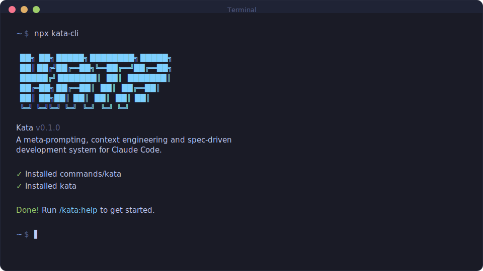

<div align="center">

# KATA

**型** · /ˈkɑːtɑː/ · *noun*
<br>
<sub>a choreographed pattern practiced repeatedly until perfected</sub>

<br>

**Agent orchestration framework for spec-driven development.**

[](https://www.npmjs.com/package/@gannonh/kata)
<br>

```bash
npx @gannonh/kata
```

**Works on Mac, Windows, and Linux.**

<br>



<br>

**Trusted by engineers at Amazon, Google, Shopify, and Webflow.**

</div>

---

## Who This Is For

Teams and individuals that want to describe what they want and have it built correctly.

---

## Getting Started

```bash
npx @gannonh/kata
```

Verify with `/kata:help` inside Claude Code.

### Staying Updated

Kata updates frequently. Check for changes:

```
/kata:whats-new
```

Update:

```bash
npx @gannonh/kata@latest
```

<details>
<summary><strong>Non-interactive Install (Docker, CI, Scripts)</strong></summary>

```bash
npx @gannonh/kata --global   # Install to ~/.claude/
npx @gannonh/kata --local    # Install to ./.claude/
```

Use `--global` (`-g`) or `--local` (`-l`) to skip the interactive prompt.

</details>

<details>
<summary><strong>Development Installation</strong></summary>

Clone the repository and run the installer locally:

```bash
git clone https://github.com/gannonh/kata.git
cd kata
node bin/install.js --local
```

Installs to `./.claude/` for testing modifications before contributing.

</details>

### Recommended: Skip Permissions Mode

Kata automates many operations. Run Claude Code with:

```bash
claude --dangerously-skip-permissions
```

> [!TIP]
> Kata works best this way. Approving `date` and `git commit` 50 times slows down the workflow.

<details>
<summary><strong>Alternative: Granular Permissions</strong></summary>

Add this to your project's `.claude/settings.json`:

```json
{
  "permissions": {
    "allow": [
      "Bash(date:*)",
      "Bash(echo:*)",
      "Bash(cat:*)",
      "Bash(ls:*)",
      "Bash(mkdir:*)",
      "Bash(wc:*)",
      "Bash(head:*)",
      "Bash(tail:*)",
      "Bash(sort:*)",
      "Bash(grep:*)",
      "Bash(tr:*)",
      "Bash(git add:*)",
      "Bash(git commit:*)",
      "Bash(git status:*)",
      "Bash(git log:*)",
      "Bash(git diff:*)",
      "Bash(git tag:*)"
    ]
  }
}
```

</details>

## What is This

This project began as a fork of the [GSD system](https://github.com/glittercowboy/get-shit-done), and then quickly became a hard fork. Why hard fork and not contribute to the original project? Because I'm a control freak. Just kidding (kind of). The real reason is two fold, well three, or two and a half.

- **Team-oriented by design.** GSD, as its brilliant creator has made very clear, is optimized for solo devs, viewing "enterprise" features as anti-patterns. I love the simplicity of GSD and respect its opinionated position, but the projects I work on are more often than not multi-player. At a minimum, I need:
  - **GitHub integration** — PRs, issues, code review workflows. Planning that connects to where teams actually collaborate.
  - **IDE agnostic** — Not everyone uses Claude Code (I do but I'm not everyone). Kata should work with the tools teams prefer.

- **Skills as the foundation.** GSD is primarily built on `/commands`, which are Claude Code-specific. Kata standardizes on **skills** — an emerging open standard supported across major agentic frameworks. 
  - This makes Kata portable and future-proof, not locked to a single tool.
  - Skills use progressive discolsure to keep prompts lean and efficient.
  - Skills instantiate with natural language, which is especially convenient when using text-to-speech as your primary input device (you can still invoke with a slash command but it isn't necessary)

---

## How It Works

> **Existing codebase?** Run `/kata:map-codebase` first. It spawns parallel agents to analyze your stack, architecture, conventions, and concerns. Then `/kata:new-project` references your codebase. Questions focus on what you're adding, and planning loads your patterns automatically.

### 1. Initialize Project

```
/kata:new-project
```

One command, one flow. The system:

1. **Questions** — Asks until it understands your idea completely (goals, constraints, tech preferences, edge cases)
2. **Research** — Spawns parallel agents to investigate the domain (optional but recommended)
3. **Requirements** — Extracts what's v1, v2, and out of scope
4. **Roadmap** — Creates phases mapped to requirements

You approve the roadmap. Now you're ready to build.

**Creates:** `PROJECT.md`, `REQUIREMENTS.md`, `ROADMAP.md`, `STATE.md`, `.planning/research/`

---

### 2. Discuss Phase

```
/kata:discuss-phase 1
```

**Here you shape the implementation.**

Your roadmap has a sentence or two per phase. That lacks enough context to build something the way you imagine it. This step captures your preferences before anything gets researched or planned.

The system analyzes the phase and identifies gray areas based on what's being built:

- **Visual features** → Layout, density, interactions, empty states
- **APIs/CLIs** → Response format, flags, error handling, verbosity
- **Content systems** → Structure, tone, depth, flow
- **Organization tasks** → Grouping criteria, naming, duplicates, exceptions

For each area you select, it asks until you're satisfied. The output, `CONTEXT.md`, feeds directly into the next two steps:

1. **Researcher reads it** — Knows what patterns to investigate ("user wants card layout" → research card component libraries)
2. **Planner reads it** — Knows what decisions are locked ("infinite scroll decided" → plan includes scroll handling)

Going deeper here makes the system build what you actually want. Skip it and you get reasonable defaults. Use it and you get your vision.

**Creates:** `{phase}-CONTEXT.md`

---

### 3. Plan Phase

```
/kata:plan-phase 1
```

The system:

1. **Researches** — Investigates how to implement this phase, guided by your CONTEXT.md decisions
2. **Plans** — Creates 2-3 atomic task plans with XML structure
3. **Verifies** — Checks plans against requirements, loops until they pass

Each plan is small enough to execute in a fresh context window. No degradation, no "I'll be more concise now."

**Creates:** `{phase}-RESEARCH.md`, `{phase}-{N}-PLAN.md`

---

### 4. Execute Phase

```
/kata:execute-phase 1
```

The system:

1. **Runs plans in waves** — Parallel where possible, sequential when dependent
2. **Fresh context per plan** — 200k tokens purely for implementation, zero accumulated garbage
3. **Commits per task** — Every task gets its own atomic commit
4. **Verifies against goals** — Checks the codebase delivers what the phase promised

Walk away, come back to completed work with clean git history.

**Creates:** `{phase}-{N}-SUMMARY.md`, `{phase}-VERIFICATION.md`

---

### 5. Verify Work

```
/kata:verify-work 1
```

**Here you confirm it actually works.**

Automated verification checks that code exists and tests pass. But does the feature work the way you expected? This is your chance to use it.

The system:

1. **Extracts testable deliverables** — What you should be able to do now
2. **Walks you through one at a time** — "Can you log in with email?" Yes/no, or describe what's wrong
3. **Diagnoses failures automatically** — Spawns debug agents to find root causes
4. **Creates verified fix plans** — Ready for immediate re-execution

If everything passes, you move on. If something's broken, you don't manually debug. Run `/kata:execute-phase` again with the fix plans it created.

**Creates:** `{phase}-UAT.md`, fix plans if issues found

---

### 6. Repeat → Complete → Next Milestone

```
/kata:discuss-phase 2
/kata:plan-phase 2
/kata:execute-phase 2
/kata:verify-work 2
...
/kata:complete-milestone
/kata:new-milestone
```

Loop **discuss → plan → execute → verify** until milestone complete.

Each phase gets your input (discuss), research (plan), clean execution (execute), and human verification (verify). Context stays fresh. Quality stays high.

When all phases are done, `/kata:complete-milestone` archives the milestone and tags the release.

Then `/kata:new-milestone` starts the next version. Same flow as `new-project` but for your existing codebase. You describe what you want to build next, the system researches the domain, you scope requirements, and it creates a fresh roadmap. Each milestone is a clean cycle: define → build → ship.

---

## Why It Works

### Context Engineering

Claude Code performs well with the right context. Most users don't provide it.

Kata handles it for you:

| File              | Function                                                      |
| ----------------- | ------------------------------------------------------------- |
| `PROJECT.md`      | Project vision, always loaded                                 |
| `research/`       | Ecosystem knowledge (stack, features, architecture, pitfalls) |
| `REQUIREMENTS.md` | Scoped v1/v2 requirements with phase traceability             |
| `ROADMAP.md`      | Where you're going, what's done                               |
| `STATE.md`        | Decisions, blockers, position — memory across sessions        |
| `PLAN.md`         | Atomic task with XML structure, verification steps            |
| `SUMMARY.md`      | What happened, what changed, committed to history             |
| `todos/`          | Captured ideas and tasks for later work                       |

Size limits based on where Claude's quality degrades. Stay under, get consistent results.

### XML Prompt Formatting

Every plan is structured XML optimized for Claude:

```xml
<task type="auto">
  <name>Create login endpoint</name>
  <files>src/app/api/auth/login/route.ts</files>
  <action>
    Use jose for JWT (not jsonwebtoken - CommonJS issues).
    Validate credentials against users table.
    Return httpOnly cookie on success.
  </action>
  <verify>curl -X POST localhost:3000/api/auth/login returns 200 + Set-Cookie</verify>
  <done>Valid credentials return cookie, invalid return 401</done>
</task>
```

Precise instructions. No guessing. Verification built in.

### Multi-Agent Orchestration

Every stage uses the same pattern: a thin orchestrator spawns specialized agents, collects results, and routes to the next step.

| Stage        | Orchestrator does                  | Agents do                                                                  |
| ------------ | ---------------------------------- | -------------------------------------------------------------------------- |
| Research     | Coordinates, presents findings     | 4 parallel researchers investigate stack, features, architecture, pitfalls |
| Planning     | Validates, manages iteration       | Planner creates plans, checker verifies, loop until pass                   |
| Execution    | Groups into waves, tracks progress | Executors implement in parallel, each with fresh 200k context              |
| Verification | Presents results, routes next      | Verifier checks codebase against goals, debuggers diagnose failures        |

The orchestrator spawns agents, waits, and integrates results.

**Result:** You can run an entire phase (deep research, multiple plans created and verified, thousands of lines of code written across parallel executors, automated verification against goals) and your main context window stays at 30-40%. The work happens in fresh subagent contexts. Your session stays fast and responsive.

### Atomic Git Commits

Each task gets its own commit immediately after completion:

```bash
abc123f docs(08-02): complete user registration plan
def456g feat(08-02): add email confirmation flow
hij789k feat(08-02): implement password hashing
lmn012o feat(08-02): create registration endpoint
```

> [!NOTE]
> **Benefits:** Git bisect finds exact failing task. Each task independently revertable. Clear history for Claude in future sessions. Better observability in AI-automated workflow.

Every commit is surgical, traceable, and meaningful.

### Modular by Design

- Add phases to current milestone
- Insert urgent work between phases
- Complete milestones and start fresh
- Adjust plans without rebuilding everything

The system adapts.

---

## Commands

### Core Workflow

| Command                      | Function                                                           |
| ---------------------------- | ------------------------------------------------------------------ |
| `/kata:new-project`          | Full initialization: questions → research → requirements → roadmap |
| `/kata:discuss-phase [N]`    | Capture implementation decisions before planning                   |
| `/kata:plan-phase [N]`       | Research + plan + verify for a phase                               |
| `/kata:execute-phase <N>`    | Execute all plans in parallel waves, verify when complete          |
| `/kata:verify-work [N]`      | Manual user acceptance testing ¹                                   |
| `/kata:complete-milestone`   | Archive milestone, tag release                                     |
| `/kata:new-milestone [name]` | Start next version: questions → research → requirements → roadmap  |

### Navigation

| Command          | Function                          |
| ---------------- | --------------------------------- |
| `/kata:progress` | Where am I? What's next?          |
| `/kata:help`     | Show all commands and usage guide |

### Brownfield

| Command              | Function                                     |
| -------------------- | -------------------------------------------- |
| `/kata:map-codebase` | Analyze existing codebase before new-project |

### Phase Management

| Command                  | Function                          |
| ------------------------ | --------------------------------- |
| `/kata:add-phase`        | Append phase to roadmap           |
| `/kata:insert-phase [N]` | Insert urgent work between phases |
| `/kata:remove-phase [N]` | Remove future phase, renumber     |

### Session

| Command             | Function                               |
| ------------------- | -------------------------------------- |
| `/kata:pause-work`  | Create handoff when stopping mid-phase |
| `/kata:resume-work` | Restore from last session              |

### Utilities

| Command                 | Function                                   |
| ----------------------- | ------------------------------------------ |
| `/kata:add-todo [desc]` | Capture idea for later                     |
| `/kata:check-todos`     | List pending todos                         |
| `/kata:debug [desc]`    | Systematic debugging with persistent state |

<sup>¹ Contributed by reddit user OracleGreyBeard</sup>

---

## Troubleshooting

**Commands not found after install?**
- Restart Claude Code to reload slash commands
- Verify files exist in `~/.claude/commands/gsd/` (global) or `./.claude/commands/gsd/` (local)

**Commands not working as expected?**
- Run `/kata:help` to verify installation
- Re-run `npx @gannonh/kata` to reinstall

**Updating to the latest version?**
```bash
npx @gannonh/kata@latest
```

**Using Docker or containerized environments?**

If file reads fail with tilde paths (`~/.claude/...`), set `CLAUDE_CONFIG_DIR` before installing:
```bash
CLAUDE_CONFIG_DIR=/home/youruser/.claude npx @gannonh/kata --global
```
This ensures absolute paths are used instead of `~` which may not expand correctly in containers.

---

## License

MIT License. See [LICENSE](LICENSE) for details.

---

<div align="center">

**Claude Code performs well. Kata makes it reliable.**

</div>
